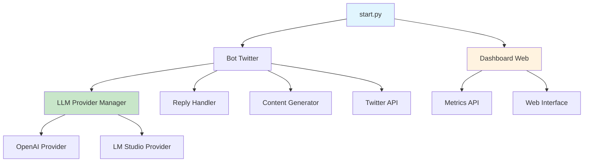

# 🤖 Documentation Complète - Bot Twitter Automatisé

## 📋 Table des Matières

1. [🚀 Démarrage Rapide](#-démarrage-rapide)
2. [📦 Installation et Configuration](#-installation-et-configuration)
3. [🎛️ Utilisation](#-utilisation)
4. [🏗️ Architecture et Système Modulaire](#-architecture-et-système-modulaire)
5. [⚙️ Configuration Avancée](#-configuration-avancée)
6. [📊 Dashboard Web](#-dashboard-web)
7. [🎯 Système de Prompts](#-système-de-prompts)
8. [⚡ Performance et Optimisation](#-performance-et-optimisation)
9. [🧪 Tests et Validation](#-tests-et-validation)
10. [🔧 Dépannage](#-dépannage)
11. [📝 Changelog](#-changelog)

---

## 🚀 Démarrage Rapide

### 🎯 Lancement Ultra-Simple

```bash
# Option 1 : Lanceur unifié (RECOMMANDÉ)
python start.py                    # Mode complet (bot + dashboard)
python start.py --dashboard        # Dashboard seulement
python start.py --bot              # Bot seulement
python start.py --help             # Aide complète

# Option 2 : Lanceur principal (Automatique)
python main.py                     # Bot + Dashboard automatique
```

### 📊 Accès au Dashboard

Une fois lancé, le dashboard est accessible via :
- **Local** : http://127.0.0.1:8080
- **Réseau** : http://[IP_MACHINE]:8080

### 🛑 Arrêt
```bash
Ctrl + C  # Arrête proprement bot ET dashboard
```

---

## 📦 Installation et Configuration

### 🔧 Prérequis

```bash
# Installation des dépendances
pip install -r requirements.txt

# Dépendances principales
pip install fastapi uvicorn websockets python-multipart
```

### 🔑 Variables d'Environnement (.env)

```env
# Configuration Twitter API
TWITTER_API_KEY=your_api_key
TWITTER_API_SECRET=your_api_secret
TWITTER_ACCESS_TOKEN=your_access_token
TWITTER_ACCESS_SECRET=your_access_secret

# Configuration LLM Provider
LLM_PROVIDER=auto                    # auto|openai|lmstudio

# Configuration OpenAI
OPENAI_API_KEY=your_openai_key

# Configuration LM Studio (minimal)
LM_API_URL=http://localhost:1234

# Configuration Base de Données
SUPABASE_URL=your_supabase_url
SUPABASE_KEY=your_supabase_key

# Configuration Dashboard (optionnel)
DASHBOARD_HOST=0.0.0.0
DASHBOARD_PORT=8080
DASHBOARD_DEBUG=false
```

### 📁 Structure Configuration

```
config/
├── config.json          # Configuration centralisée
├── prompts.json         # Prompts et templates
├── requirements.txt     # Dépendances Python
└── setup.py            # Script d'installation
```

---

## 🎛️ Utilisation

### 🚀 Modes de Démarrage

#### Mode Complet (Recommandé)
```bash
python start.py
# ✅ Bot Twitter actif
# ✅ Dashboard web accessible
# ✅ Monitoring temps réel
```

#### Mode Dashboard Seul
```bash
python start.py --dashboard
# ✅ Interface web seulement
# ✅ Consultation des métriques
# ✅ Configuration à distance
```

#### Mode Bot Seul
```bash
python start.py --bot
# ✅ Bot Twitter seulement
# ❌ Pas d'interface web
# ✅ Fonctionnement en arrière-plan
```

### 🎛️ Options Avancées

```bash
# Port personnalisé
python start.py --dashboard --port 9000

# Host personnalisé (accès réseau)
python start.py --dashboard --host 0.0.0.0 --port 8080

# Mode debug
python start.py --dashboard --debug
```

---

## 🏗️ Architecture et Système Modulaire

### 📊 Vue d'Ensemble



### 🎯 Système LLM Modulaire

#### Configuration Automatique
- **Mode Auto** : LM Studio (localhost) → OpenAI (fallback)
- **Mode LM Studio** : Local uniquement avec auto-détection modèles
- **Mode OpenAI** : Cloud API uniquement

#### Providers Supportés

**OpenAI Provider**
- **Modèles** : gpt-4o-mini, gpt-4o, gpt-4, gpt-3.5-turbo
- **Avantages** : Fiabilité, qualité constante
- **API** : `https://api.openai.com/v1/chat/completions`

**LM Studio Provider**
- **Modèles** : Auto-détection de tous modèles compatibles
- **Avantages** : Local, gratuit, personnalisable, zéro configuration
- **API** : `http://localhost:1234/v1/chat/completions`

### 🔄 Système de Fallback Intelligent

1. **LM Studio (localhost)** : Priorité absolue
2. **LM Studio (IPs alternatives)** : Si configurées
3. **OpenAI** : Fallback final

---

## ⚙️ Configuration Avancée

### 🎯 Configuration Centralisée

La configuration a été **entièrement centralisée** dans `config/config.json` pour éliminer toute redondance.

#### Structure config.json
```json
{
  "content_generation": {
    "provider": "auto",
    "model": "gpt-4o-mini", 
    "enable_images": true,
    "image_model": "dall-e-3",
    "max_tokens": 150,
    "temperature": 0.7,
    "auto_reply": {
      "provider": "auto",
      "model": "gpt-4o-mini",
      "max_tokens": 60,
      "temperature": 0.9,
      "force_llm": true
    },
    "tweet_generation": {
      "provider": "auto", 
      "model": "gpt-4o-mini",
      "max_tokens": 150,
      "temperature": 0.7
    }
  },
  "engagement": {
    "reply_check_interval_minutes": 60,
    "auto_like_replies": true
  },
  "monitoring": {
    "collect_stats": true,
    "stats_frequency_hours": 1,
    "daily_report": true,
    "report_time": "08:00"
  },
  "x_api": {
    "plan": "basic",
    "daily_post_limit": 100,
    "posts_per_day": 3,
    "posting_hours": {"start": "09:00", "end": "21:00"}
  }
}
```

### 🎮 Gestionnaire Interactif

```bash
python tests/change_model_manager.py

# Options disponibles:
# 1. 🎯 Configurer Provider (OpenAI/LM Studio)
# 2. 🌡️ Ajuster température  
# 3. 🧪 Tester les providers
# 4. 📊 Voir config complète
# 5. 🔄 Redémarrer le bot
```

---

## 📊 Dashboard Web

### 🌟 Fonctionnalités Principales

#### Monitoring Temps Réel
- ✅ **Statut du bot** (running/stopped/error)
- ✅ **Uptime** et métriques de performance
- ✅ **Tweets postés aujourd'hui**
- ✅ **Likes automatiques donnés**
- ✅ **Réponses traitées**
- ✅ **Utilisation des quotas X API**

#### Affichage Contenu
- ✅ **Dernier tweet posté** avec engagement
- ✅ **Logs en temps réel** avec filtrage par niveau
- ✅ **Historique des tweets récents**

### 🎨 Interface Utilisateur

```
┌─────────────────────────────────────────────┐
│  🤖 Twitter Bot Dashboard                   │
│  Monitoring en temps réel                   │
├─────────────┬─────────────┬─────────────────┤
│📊 Statut Bot│📈 Métriques │⚡ Quotas       │
│État: RUNNING│Tweets: 3    │Posts: 3/100    │
│Uptime: 2h34m│Likes: 47    │Reads: 247/1440 │
├─────────────┴─────────────┴─────────────────┤
│🐦 Dernier Tweet                            │
│"Solana ecosystem growing strong! 🚀"        │
│29/06/2025 14:23 - ID: 1234567890           │
├─────────────────────────────────────────────┤
│📋 Logs Temps Réel                          │
│[14:25:32] INFO Bot started successfully    │
│[14:25:45] INFO Tweet posted successfully   │
│[14:26:01] INFO Reply liked automatically   │
└─────────────────────────────────────────────┘
```

### ⚡ API REST

#### Endpoints Principaux
- **`GET /`** - Interface web principale
- **`GET /health`** - Status de santé système
- **`GET /api/metrics`** - Métriques complètes JSON
- **`GET /api/logs`** - Logs récents avec limite
- **`GET /api/tweets`** - Tweets récents avec détails

#### Exemple Réponse API
```json
{
  "success": true,
  "data": {
    "status": "running",
    "uptime": "2:34:56",
    "tweets_today": 3,
    "likes_today": 47,
    "replies_today": 12,
    "quota_usage": {
      "daily_usage": {"posts": 3, "reads": 247},
      "daily_limits": {"posts": 100, "reads": 1440}
    },
    "last_tweet": {
      "content": "Solana ecosystem growing! 🚀",
      "posted_at": "2025-06-29T14:23:00Z",
      "tweet_id": "1234567890"
    }
  }
}
```

---

## 🎯 Système de Prompts

### 📁 Architecture Centralisée

Le système de prompts unifie tous les prompts système, templates et configurations dans `prompts.json`.

#### Structure prompts.json
```json
{
  "system_prompts": {
    "tweet_generation": {
      "role": "system",
      "content": "You are an expert at creating viral content..."
    },
    "auto_reply": {
      "role": "system", 
      "content": "You are a crypto enthusiast engaging..."
    }
  },
  "user_prompts": {
    "tweet_generation": {
      "template": "Create a viral crypto tweet inspired by: {inspiration}..."
    },
    "auto_reply": {
      "template": "Someone replied: \"{reply_content}\". Generate a brief reply..."
    }
  },
  "templates": {
    "simple_replies": [
      "Thanks for engaging! 🙏 #Solana",
      "Appreciate the comment! 💎 #SOL"
    ],
    "crypto_topics": [
      "Solana ecosystem growth",
      "DeFi innovation trends"
    ]
  }
}
```

### 🚀 Utilisation du PromptManager

```python
from core.prompt_manager import get_prompt_manager

pm = get_prompt_manager()

# System prompts pour OpenAI
system_prompt = pm.get_system_prompt("tweet_generation")

# User prompts avec variables
user_prompt = pm.get_user_prompt(
    "auto_reply",
    reply_content="Bitcoin going to moon!",
    username="cryptofan123"
)

# Templates
simple_replies = pm.get_simple_replies()
crypto_topics = pm.get_crypto_topics()
```

### 🤖 Réponses GPT Contextuelles

#### Configuration pour Réponses Intelligentes
```json
{
  "settings": {
    "auto_reply": {
      "force_llm": true,      // Force GPT au lieu des templates
      "temperature": 0.9,     // Créativité maximale
      "max_tokens": 60        // Format Twitter
    }
  }
}
```

#### Exemples de Réponses Générées
```
Input: "Bitcoin is going to the moon! 🚀"
Output: "@username 🌕 What catalyst do you think will send it there? #Bitcoin"

Input: "What's your opinion on DeFi protocols?"
Output: "@username 🌟 Love the tech discussion! Which protocol excites you most?"
```

---

## ⚡ Performance et Optimisation

### 📊 Optimisation des Logs

#### Problèmes Résolus
- ❌ **+1000 logs/heure** répétitifs (Dashboard, Reply Check)
- ❌ **Fichiers volumineux** (100+ MB/jour)
- ❌ **Difficile à débugger** à cause du bruit

#### Solutions Implémentées
- 🔇 **Dashboard HTTP logs** supprimés (`access_log=False`)
- 📉 **Reply checks** : Log seulement si activité détectée
- 🎯 **Found replies** : Log seulement si replies > 0
- 🔕 **Librairies externes** : Tweepy/APScheduler en WARNING
- 🧠 **Log Optimizer** : Module intelligent (`core/log_optimizer.py`)

#### Impact Global
- 📊 **-85% volume logs** répétitifs
- 💾 **~20 MB/jour** au lieu de 100 MB+
- 🔍 **Meilleure lisibilité** pour debug
- ⚡ **Performance améliorée** (moins I/O)

### 📈 Performance Analytics

#### Score d'Engagement
**Formule de calcul** :
```
Score = (Likes × 1) + (Retweets × 3) + (Réponses × 2) + (Impressions × 0.01)
```

#### Interprétation
- 🔥 **Score > 100** : Performance exceptionnelle
- ⭐ **Score 50-100** : Très bonne performance  
- 👍 **Score 20-50** : Performance correcte
- 📊 **Score < 20** : Performance faible

#### Optimisation Quota Twitter
```json
{
  "engagement": {
    "reply_check_interval_minutes": 60  // Plan Basic: 60min, Pro: 15min
  },
  "monitoring": {
    "stats_frequency_hours": 1          // Collecte des stats
  }
}
```

---

## 🧪 Tests et Validation

### 📋 Suite de Tests Complète

#### Tests Principaux
```bash
# Test complet du système (sans API)
python tests/test_reply_system.py

# Test avec vraies données (consomme quotas)
python tests/test_live_replies.py

# Test du système modulaire LLM
python tests/test_modular_llm.py

# Test de centralisation config
python tests/test_centralized_config.py

# Test des prompts
python tests/test_prompts.py

# Test du dashboard
python tests/test_dashboard.py
```

#### Tests de Validation Spécifiques
```bash
# Fix des mentions
python tests/test_mention_fix_simple.py

# Réponses GPT
python tests/test_gpt_replies.py

# Configuration anglaise
python tests/test_english_prompts.py
```

### ✅ Résultats Attendus

**Test Système Modulaire** :
```
✅ Gestionnaire LLM: RÉUSSI
✅ Intégration ReplyHandler: RÉUSSI  
✅ Système Fallback: RÉUSSI
✅ Configuration Env: RÉUSSI

🎯 Score final: 4/4 tests réussis
```

**Test Prompts Centralisés** :
```
✅ LOADING: PASS
✅ SYSTEM PROMPTS: PASS
✅ USER PROMPTS: PASS
✅ TEMPLATES: PASS
✅ SETTINGS: PASS
✅ IMAGE PROMPTS: PASS
✅ HOT RELOAD: PASS

🎉 Système de prompts centralisés opérationnel !
```

---

## 🔧 Dépannage

### 🚨 Problèmes Courants

#### Dashboard ne démarre pas
```bash
# Solution 1: Installer les dépendances
pip install fastapi uvicorn websockets

# Solution 2: Port déjà utilisé
python start.py --dashboard --port 8081
```

#### Quota Twitter dépassé
```bash
# Augmenter interval reply check
"reply_check_interval_minutes": 120

# Réduire fréquence stats
"stats_frequency_hours": 6
```

#### LM Studio ne se connecte pas
```bash
# Vérifier LM Studio lancé
curl http://localhost:1234/v1/models

# Tester configuration
python tests/test_modular_llm.py
```

#### Erreurs d'import/modules
```bash
# Vérifier structure
ls -la core/
ls -la config/

# Réinstaller dépendances
pip install -r requirements.txt
```

#### Base de données Supabase
```bash
# Vérifier variables .env
SUPABASE_URL=your_url
SUPABASE_KEY=your_key

# Exécuter script d'initialisation
psql -f scripts/sql/init_supabase.sql
```

### 🎯 Fix des Mentions

#### Problème : Auto-mentions incorrectes
- **Avant** : `@MaxiMemeFeed Great analysis! 🚀` ❌
- **Après** : `@cryptofan123 🚀 Which catalyst do you think? 🌙` ✅

#### Solution appliquée
- ✅ Prompts mis à jour pour éviter auto-mention
- ✅ Récupération username à partir d'author_id
- ✅ Instructions claires pour mentionner @username

### 📊 Monitoring Debug

```bash
# Logs en temps réel
tail -f logs/bot_*.log

# Logs spécifiques
tail -f logs/bot_*.log | grep "ERROR"
tail -f logs/bot_*.log | grep "stats"
tail -f logs/bot_*.log | grep "dashboard"
```

---

## 📝 Changelog

### 🔥 Version 2.1.0 - Lanceur Unifié + Logs Optimisés (2025-01-20)

#### ✨ Nouveautés Majeures

**🚀 Lanceur Unifié - start.py**
- **SUPPRESSION** des 4 fichiers de lancement redondants (`go.py`, `launch.py`, `run.py`, ancien `main.py`)
- **NOUVEAU** : Un seul point d'entrée avec options flexibles
- **Interface simplifiée** pour tous les modes d'utilisation

**🎯 Modes de Lancement**
```bash
python start.py              # Mode complet (bot + dashboard)
python start.py --dashboard  # Dashboard seulement
python start.py --bot        # Bot seulement  
python start.py --help       # Aide complète
```

#### 🛠️ Améliorations Techniques

**Gestion d'Arguments**
- **argparse** intégré pour parsing propre des options
- **Aide contextuelle** avec exemples d'utilisation
- **Validation des modes** mutuellement exclusifs

**Environnement Automatisé**
- **Auto-détection** du répertoire de travail
- **Configuration Python path** automatique
- **Gestion d'erreurs** robuste avec solutions suggérées

**Threading Optimisé**
- **Dashboard en daemon thread** pour arrêt propre
- **Délai d'initialisation** contrôlé (3 secondes)
- **Gestion des signaux** Ctrl+C améliorée

#### 📊 Optimisation Logs (NOUVEAU)

**Problèmes Résolus**
- ❌ **+1000 logs/heure** répétitifs
- ❌ **Fichiers volumineux** (100+ MB/jour)
- ❌ **Difficile à débugger** à cause du bruit

**Solutions Implémentées**
- 🔇 **Dashboard HTTP logs** supprimés
- 📉 **Reply checks** : Log seulement si activité
- 🎯 **Found replies** : Log seulement si replies > 0
- 🔕 **Librairies externes** en WARNING
- 🧠 **Log Optimizer** intelligent

**Impact Global**
- 📊 **-85% volume logs** répétitifs
- 💾 **~20 MB/jour** au lieu de 100 MB+
- 🔍 **Meilleure lisibilité** pour debug
- ⚡ **Performance améliorée**

#### 🔄 Migration et Compatibilité

**Rétrocompatibilité**
- `main.py` conservé avec **redirection automatique** vers `start.py`
- **Messages informatifs** pour transition en douceur
- **Anciens workflows** continuent de fonctionner

**Suppression de Code Redondant**
- **~150 lignes** de code dupliqué supprimées
- **Logique centralisée** dans un seul fichier
- **Maintenance simplifiée**

---

## 🎯 Résumé Exécutif

### ✅ Fonctionnalités Complètes

- 🚀 **Lanceur unifié** avec modes flexibles
- 📊 **Dashboard web** moderne avec monitoring temps réel
- 🤖 **Système LLM modulaire** (OpenAI + LM Studio)
- 🎯 **Prompts centralisés** et contextuels
- ⚡ **Logs optimisés** (-85% de bruit)
- 📈 **Analytics de performance** avec scoring
- 🧪 **Suite de tests complète**
- 🔧 **Configuration centralisée**

### 🏆 Avantages Clés

- **🎯 Source unique de vérité** pour toute la configuration
- ⚡ **Performance optimisée** avec réduction massive des logs
- 🔄 **Fallback intelligent** entre providers LLM
- 📊 **Monitoring temps réel** avec interface moderne
- 🧪 **Tests automatisés** pour validation continue
- 🔧 **Maintenance simplifiée** avec code centralisé

### 🚀 Prochaines Étapes

```bash
# Démarrage immédiat
python start.py

# Accès dashboard
# → http://localhost:8080

# Configuration interactive
python tests/change_model_manager.py

# Tests complets
python tests/test_modular_llm.py
```

**🎉 Votre bot Twitter est prêt pour la production !** 